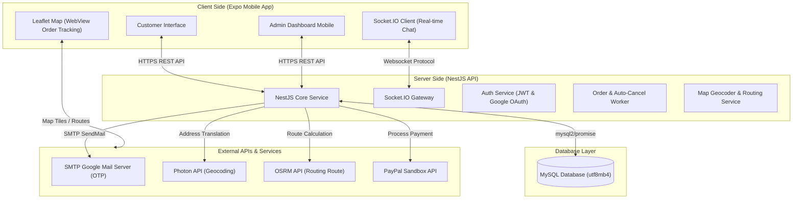

# 🛍️ Sello E-Commerce Mobile App

[](https://expo.dev/)
[](https://reactnative.dev/)
[](https://nestjs.com/)
[](https://www.mysql.com/)

**Sello E-Commerce** là một dự án ứng dụng di động mua sắm trực tuyến toàn diện (Full-stack E-commerce System) được thiết kế và xây dựng như một đồ án môn học chuyên nghiệp. Hệ thống tích hợp đầy đủ từ ứng dụng di động dành cho Khách hàng (Customer App), hệ thống quản trị dành cho Admin (Admin Dashboard trên Mobile), máy chủ API trung tâm (NestJS Backend) đến cơ sở dữ liệu quan hệ (MySQL Database). Giao diện và trải nghiệm người dùng (UI/UX) được thiết kế tỉ mỉ lấy cảm hứng từ Figma và mô hình hoạt động tương tự như Shopee.

---

## 📌 Tổng Quan Hệ Thống

Dự án bao gồm hai thành phần cốt lõi nằm chung trong một kho mã nguồn thống nhất:

1. **[FrontEnd (Mobile App)](file:///c:/Users/hokha/Dropbox/PC/Downloads/LearningDocuments/DA-TTLT-A/Sello-E-commerce-mobile-app/FrontEnd)**: Ứng dụng di động đa nền tảng (iOS & Android) được xây dựng bằng **React Native** thông qua công cụ **Expo**. Sử dụng kiến trúc định tuyến file-based **Expo Router** và phong cách thiết kế hiện đại với **NativeWind (Tailwind CSS)**.
2. **[BackEnd (API Server)](file:///c:/Users/hokha/Dropbox/PC/Downloads/LearningDocuments/DA-TTLT-A/Sello-E-commerce-mobile-app/BackEnd)**: Máy chủ API hiệu năng cao được phát triển trên khung **NestJS** (TypeScript). Sử dụng cơ chế kết nối cơ sở dữ liệu qua `mysql2/promise` với khả năng tự động khôi phục và kiểm tra nâng cấp lược đồ (Self-healing Migrations).
3. **[Sơ đồ & Tài liệu (Diagram & Document)](file:///c:/Users/hokha/Dropbox/PC/Downloads/LearningDocuments/DA-TTLT-A/Sello-E-commerce-mobile-app/Diagram%20%26%20Document)**: Tập hợp đầy đủ các sơ đồ thiết kế hệ thống như Usecase, Class Diagram, 26 Sequence Diagrams cho từng luồng chức năng, sơ đồ phân rã chức năng và báo cáo chi tiết bằng tiếng Việt.



---

## 🛠️ Công Nghệ Sử Dụng

### 📱 FrontEnd (Mobile App)
* **Expo SDK 55** & **React Native 0.83** & **React 19**
* **Expo Router**: Quản lý điều hướng linh hoạt dựa trên cấu trúc thư mục.
* **NativeWind v4 (Tailwind CSS)**: Thiết kế giao diện responsive và nhất quán bằng các class tiện ích.
* **Shopify FlashList v2.x**: Cuộn danh sách sản phẩm lớn cực kỳ mượt mà, tối ưu hóa tái sử dụng view.
* **Expo Image**: Xử lý bộ nhớ đệm hình ảnh thông minh, hiển thị ảnh sắc nét và giảm thiểu tài nguyên.
* **React Native WebView & Leaflet**: Hiển thị bản đồ theo dõi đơn hàng không cần API Key Google Maps.
* **Socket.IO Client**: Kết nối chat thời gian thực với quản trị viên.

### 💻 BackEnd (API Server)
* **NestJS 11** (TypeScript): Kiến trúc module mạnh mẽ, dễ mở rộng và bảo trì.
* **Socket.IO (WebSockets)**: Cung cấp phòng chat (room-based) hỗ trợ trực tiếp thời gian thực.
* **Nodemailer**: Gửi email OTP đăng ký và khôi phục mật khẩu.
* **Passport.js & JWT & Google OAuth2**: Quản lý xác thực an toàn, hỗ trợ đăng nhập qua Google.
* **Photon Geocoder & OSRM Routing**: Tự động chuyển đổi địa chỉ thành tọa độ và tính toán đường đi shipper.
* **PayPal REST SDK (Sandbox)**: Tích hợp cổng thanh toán trực tuyến quốc tế.

### 💾 Cơ Sở Dữ Liệu
* **MySQL**: Lưu trữ quan hệ hiệu quả với cấu hình `utf8mb4` hỗ trợ hoàn toàn tiếng Việt có dấu.
* **Migrations Tự Động**: Tự phục hồi và bổ sung cột/điều chỉnh độ rộng trường dữ liệu an toàn ngay khi khởi động server.

---

## 🚀 Các Tính Năng Chính

### 🛍️ 1. Phía Khách Hàng (Customer App)
* **Đăng Nhập & Bảo Mật**: 
  * Đăng ký, đăng nhập và đăng xuất bằng JWT Token.
  * Xác minh OTP qua Email cá nhân thực tế khi đăng ký hoặc quên mật khẩu.
  * Tích hợp đăng nhập nhanh qua Google OAuth2.
  * Chức năng "Ghi nhớ đăng nhập" tự động điền thông tin (lưu trữ an toàn qua `AsyncStorage`).
* **Trải Nghiệm Mua Sắm**:
  * Trang chủ sinh động với Banner khuyến mãi tương tác và hiệu ứng tap scale animation (0.94 - 0.98) sống động cho các thẻ sản phẩm.
  * Khu vực **Flash Sale Shopee** độc quyền: Đồng hồ đếm ngược đen đặc trưng với dấu hai chấm đỏ, thanh tiến trình "Đang bán chạy" / "Sắp cháy hàng" tính toán động theo thời gian thực.
  * Tìm kiếm nâng cao kết hợp bộ lọc danh mục, xem chi tiết và lựa chọn biến thể sản phẩm (màu sắc, kích thước) dựa trên số lượng tồn kho thực tế.
  * Danh sách yêu thích (Wishlist) lưu lại các sản phẩm quan tâm.
* **Giỏ Hàng & Thanh Toán**:
  * Giỏ hàng đồng bộ hóa thời gian thực, cho phép chọn/bỏ chọn từng sản phẩm để thanh toán.
  * Xem trước hóa đơn (Checkout Preview) hiển thị chi tiết tiền hàng, phí vận chuyển và áp dụng mã giảm giá (Voucher).
  * Hỗ trợ thanh toán **PayPal Sandbox** hoặc thanh toán qua trang ngân hàng giả lập **Sello Mock Bank** bằng mã QR động.
* **Theo Dõi Đơn Hàng & Đánh Giá**:
  * Danh sách lịch sử đơn hàng phân loại chi tiết (Chờ xác nhận, Đang giao, Đã giao, Đã hủy).
  * Bản đồ **Order Tracking Map** hiển thị hành trình di chuyển thực tế của Shipper đến địa chỉ khách hàng trên nền OpenStreetMap.
  * Cho phép viết đánh giá sản phẩm (đính kèm hình ảnh và số sao) đối với các đơn hàng đã được giao (`delivered`) thành công.

### 🔑 2. Phía Quản Trị Viên (Admin Panel)
* **Phân Quyền Đa Cấp Độ (RBAC)**: Phân chia rõ ràng giữa `customer` và `admin`. Các admin được phân làm 3 cấp độ với quyền hạn chi tiết:
  * **Cấp 1 (Admin tối cao)**: Toàn quyền hệ thống, sửa đổi cấu hình hệ thống, quản lý cấp bậc vai trò người dùng, xóa vĩnh viễn dữ liệu.
  * **Cấp 2 (Admin vận hành)**: Quản lý sản phẩm, danh mục, đơn hàng, mã giảm giá và gửi thông báo, kiểm duyệt đánh giá. Không có quyền xóa dữ liệu nhạy cảm hoặc đổi vai trò người dùng.
  * **Cấp 3 (Nhân viên hỗ trợ)**: Chỉ xem dữ liệu (Read-only), duyệt xử lý đơn hàng và chat hỗ trợ khách hàng.
* **Thống Kê Trực Quan (Dashboard)**: Biểu đồ doanh thu, số lượng đơn hàng mới, số lượng khách hàng theo thời gian thực.
* **Quản Lý Đơn Hàng Kiểu Shopee**:
  * Bộ lọc trạng thái gồm 7 nhóm bằng Tiếng Việt hiển thị kèm số lượng đơn hàng thực tế động.
  * Thiết kế dạng Card trực quan hiển thị thông tin khách hàng, sản phẩm đã mua và tổng tiền.
  * Các nút thao tác nhanh 1 chạm trực tiếp trên Card (Xác nhận đơn, Gói hàng xong, Giao vận chuyển, Đã giao xong) giúp xử lý nhanh chóng.
* **Các Nghiệp Vụ Quản Trị Khác**:
  * Quản lý danh mục sản phẩm (hỗ trợ phân loại cha-con, ẩn/hiển thị).
  * Quản lý sản phẩm (thêm, sửa đổi thông tin, thiết lập biến thể màu sắc/kích cỡ, hình ảnh, giá và tồn kho).
  * Quản lý mã giảm giá (Vouchers) có giới hạn thời gian bằng lịch chọn và điều kiện áp dụng cụ thể.
  * Kiểm duyệt đánh giá của khách hàng (Ẩn/Hiện các đánh giá không phù hợp).
  * Gửi thông báo hệ thống hàng loạt đến người dùng hoặc lọc theo nhóm đối tượng.
  * Chat hỗ trợ thời gian thực trực tiếp với khách hàng gặp sự cố.

---

## 📁 Cấu Trúc Thư Mục Dự Án

```txt
Sello-E-commerce-mobile-app/
├── BackEnd/                        # Mã nguồn NestJS Backend
│   ├── src/                        # Chứa các Modules xử lý API
│   │   ├── auth/                   # Module Xác thực (Register, Login, OTP, OAuth)
│   │   ├── users/                  # Module Quản lý Người dùng
│   │   ├── products/               # Module Quản lý Sản phẩm & Biến thể
│   │   ├── orders/                 # Module Xử lý Đơn hàng & Theo dõi Shipper
│   │   ├── payments/               # Module Cổng thanh toán (PayPal, QR Mock Bank)
│   │   └── ...                     # Các module chat, notifications, vouchers, v.v.
│   ├── test/                       # Thư mục kiểm thử E2E
│   ├── Sello-Auth.postman_collection.json # Bộ testcase API qua Postman
│   ├── package.json
│   └── tsconfig.json
│
├── FrontEnd/                       # Mã nguồn Expo React Native Frontend
│   ├── app/                        # Cấu trúc định tuyến Expo Router
│   │   ├── auth/                   # Màn hình đăng nhập, đăng ký, quên mật khẩu
│   │   ├── main/                   # Các tab chính của Khách hàng (Home, Cart, Orders, Chat, Profile)
│   │   ├── admin/                  # Giao diện Dashboard & Quản lý của Admin
│   │   └── product/                # Chi tiết sản phẩm, viết đánh giá
│   ├── components/                 # Các UI Components tái sử dụng
│   ├── contexts/                   # Quản lý State chung (AuthContext)
│   ├── services/                   # Tầng gọi API kết nối đến Backend
│   ├── types/                      # Các kiểu dữ liệu TypeScript dùng chung
│   ├── tailwind.config.js          # Cấu hình NativeWind CSS
│   └── package.json
│
├── Diagram & Document/             # Tài liệu thiết kế và phân tích dự án
│   ├── Database/                   # File SQL tạo bảng và khôi phục dữ liệu mẫu
│   ├── Diagrams/                   # Sơ đồ Usecase, Class Diagram, Hệ kiến trúc
│   │   └── SD/                     # 26 Sơ đồ Sequence Diagrams chi tiết từng tính năng
│   ├── Document/                   # Slide thuyết trình và Báo cáo Đồ án chi tiết (Word/PDF)
│   ├── Admin_Descript/             # Hình ảnh chụp màn hình chức năng Admin
│   └── OrderProcessPayment/        # Hình ảnh minh họa luồng thanh toán
│
├── .env                            # Tệp cấu hình biến môi trường chung (mẫu)
└── README.md                       # Tài liệu hướng dẫn này
```

---

## 📊 Bản Vẽ Thiết Kế & Tài Liệu

Tất cả các tài liệu kỹ thuật của dự án nằm tại thư mục **[Diagram & Document](file:///c:/Users/hokha/Dropbox/PC/Downloads/LearningDocuments/DA-TTLT-A/Sello-E-commerce-mobile-app/Diagram%20%26%20Document)**:
* **Sơ đồ cấu trúc dữ liệu**: Xem tệp chi tiết [Ecommerce_Database_Description.pdf](file:///c:/Users/hokha/Dropbox/PC/Downloads/LearningDocuments/DA-TTLT-A/Sello-E-commerce-mobile-app/Diagram%20%26%20Document/Ecommerce_Database_Description.pdf) và thư mục [Database](file:///c:/Users/hokha/Dropbox/PC/Downloads/LearningDocuments/DA-TTLT-A/Sello-E-commerce-mobile-app/Diagram%20%26%20Document/Database).
* **Sơ đồ phân rã chức năng (Functional Decomposition)**: Xem hình vẽ [functional_decomposition.png](file:///c:/Users/hokha/Dropbox/PC/Downloads/LearningDocuments/DA-TTLT-A/Sello-E-commerce-mobile-app/Diagram%20%26%20Document/Diagrams/functional_decomposition.png).
* **Sơ đồ thực thể liên kết (Class Diagram)**: Xem hình vẽ [Class Diagram.drawio.png](file:///c:/Users/hokha/Dropbox/PC/Downloads/LearningDocuments/DA-TTLT-A/Sello-E-commerce-mobile-app/Diagram%20%26%20Document/Diagrams/sello-E-Commerce-diagram-Class%20Diagram.drawio.png).
* **Sơ đồ luồng (Sequence Diagrams - 26 tệp)**: Toàn bộ nằm tại [Diagrams/SD](file:///c:/Users/hokha/Dropbox/PC/Downloads/LearningDocuments/DA-TTLT-A/Sello-E-commerce-mobile-app/Diagram%20%26%20Document/Diagrams/SD), mô tả chi tiết các tác vụ phức tạp như: *Đặt hàng (Create Order)*, *Thanh toán (Checkout)*, *Đăng nhập (Login)*, *Bản đồ (Tracking)*, *Hủy đơn (Order Cancel)*, *Viết đánh giá (Write Review)*, v.v.

---

## ⚙️ Hướng Dẫn Cài Đặt & Cấu Hình

### 💾 Bước 1: Chuẩn Bị Cơ Sở Dữ Liệu MySQL
1. Mở công cụ quản trị MySQL (ví dụ MySQL Workbench hoặc DBeaver).
2. Tạo một database mới tên là `Sello_commerce`:
   ```sql
   CREATE DATABASE Sello_commerce CHARACTER SET utf8mb4 COLLATE utf8mb4_unicode_ci;
   ```
3. Chạy lệnh khôi phục dữ liệu mẫu bằng cách nhập và thực thi file **[reset_database.sql](file:///c:/Users/hokha/Dropbox/PC/Downloads/LearningDocuments/DA-TTLT-A/reset_database.sql)** nằm ở thư mục gốc của dự án.
   * *Hoặc sử dụng tệp `Sello_Reset_Data.sql` trong thư mục [Diagram & Document/Database](file:///c:/Users/hokha/Dropbox/PC/Downloads/LearningDocuments/DA-TTLT-A/Sello-E-commerce-mobile-app/Diagram%20%26%20Document/Database).*

### 🔑 Bước 2: Cấu Hình Biến Môi Trường (`.env`)
Tạo file `.env` tại thư mục gốc `Sello-E-commerce-mobile-app` (hoặc copy sang các thư mục con tương ứng) với nội dung mẫu hoạt động thực tế như sau:

```env
# 🌐 Cổng hoạt động của API Backend
PORT=3000
JWT_SECRET=sello-local-secret

# 📧 Cấu hình SMTP gửi mã OTP (Gmail App Password)
SMTP_HOST=smtp.gmail.com
SMTP_PORT=587
SMTP_USER=your_email@gmail.com
SMTP_PASS=your_gmail_app_password # Mật khẩu ứng dụng Gmail (App Password)
SMTP_FROM=Sello Ecommerce <your_email@gmail.com>

# 💾 Cấu hình Cơ sở dữ liệu MySQL
MYSQL_HOST=127.0.0.1
MYSQL_PORT=3306
MYSQL_USER=root
MYSQL_PASSWORD=your_mysql_password # Thay thế bằng mật khẩu MySQL của bạn
MYSQL_DATABASE=Sello_commerce
MYSQL_CONNECTION_LIMIT=10
MYSQL_TIMEZONE=Z

# 🌐 Cấu hình Google OAuth Login
GOOGLE_CLIENT_ID=your_google_client_id
GOOGLE_CLIENT_SECRET=your_google_client_secret
GOOGLE_CALLBACK_URL=http://localhost:3000/auth/google/callback
APP_AUTH_REDIRECT_URI=selloecommerce://auth/callback

# 🗺️ Cấu hình Bản đồ theo dõi (Photon Geocoder & OSRM Router)
PHOTON_BASE_URL=https://photon.komoot.io
PHOTON_LANG=vi
PHOTON_BIAS_LAT=10.7769
PHOTON_BIAS_LON=106.7009
OSRM_BASE_URL=https://router.project-osrm.org
MAP_REQUEST_TIMEOUT_MS=5000
MAP_USER_AGENT=Sello-Ecommerce-Backend/1.0

# 💳 Cấu hình PayPal Sandbox
PAYPAL_CLIENT_ID=your_paypal_client_id
PAYPAL_SECRET=your_paypal_secret
PAYPAL_API_URL=https://api-m.sandbox.paypal.com
PAYPAL_RETURN_URL=http://your_computer_lan_ip:3000/payments/paypal/return
PAYPAL_CANCEL_URL=selloecommerce://checkout/paypal/cancel

# 📱 Địa chỉ kết nối từ thiết bị di động (IP LAN của máy tính phát triển)
EXPO_PUBLIC_API_BASE_URL=http://your_computer_lan_ip:3000
MOCK_PAYMENT_PUBLIC_BASE_URL=http://your_computer_lan_ip:3000
MOCK_PAYMENT_TTL_MINUTES=5
```

> [!WARNING]  
> Thay đổi địa chỉ IP `192.168.1.3` trong cấu hình trên thành **địa chỉ IP LAN thực tế** của máy tính bạn (Ví dụ: `192.168.x.x` lấy từ lệnh `ipconfig` trong cmd) để điện thoại thật hoặc máy ảo chạy Expo có thể gửi yêu cầu thành công đến Backend.

---

## 🚀 Cách Chạy Dự Án

### 💻 1. Khởi Chạy Backend Server
Di chuyển vào thư mục `BackEnd` và khởi chạy máy chủ:
```bash
cd BackEnd
npm install
npm run start:dev
```
API Server sẽ lắng nghe tại cổng `http://localhost:3000` (hoặc IP LAN của bạn).

### 📱 2. Khởi Chạy Frontend Mobile App
Di chuyển vào thư mục `FrontEnd` và khởi chạy máy ảo/quét mã thiết bị:
```bash
cd FrontEnd
npm install
npm run start
```
* Bấm phím `a` để mở trên thiết bị giả lập Android.
* Quét mã QR bằng ứng dụng **Expo Go** trên điện thoại thật (cùng kết nối một mạng Wi-Fi với máy tính).

---

## 📱 Kết Nối Thiết Bị Thật & Trình Giả Lập

Khi kiểm thử trên Android Emulator và kết nối với Backend chạy local ở cổng 3000, bạn cần sử dụng công cụ **ADB (Android Debug Bridge)** để ánh xạ cổng kết nối. 

Mở PowerShell và chạy các lệnh sau:
```powershell
# 1. Kiểm tra danh sách máy ảo đang hoạt động
& "C:\Users\hokha\AppData\Local\Android\Sdk\platform-tools\adb.exe" devices

# 2. Ánh xạ cổng 3000 từ điện thoại máy ảo về máy tính local
& "C:\Users\hokha\AppData\Local\Android\Sdk\platform-tools\adb.exe" reverse tcp:3000 tcp:3000

# 3. Kiểm tra danh sách các cổng đã chuyển tiếp thành công
& "C:\Users\hokha\AppData\Local\Android\Sdk\platform-tools\adb.exe" reverse --list
```

---

## 🔄 Các Quy Trình Nghiệp Vụ Nâng Cao

### 💬 1. Kết Nối Chat Thời Gian Thực (Socket.IO)
Tính năng chat trực tiếp giữa Khách hàng và Admin được vận hành thông qua giao thức Socket.IO.
* Khi khách hàng mở trang Chat, Client sẽ gửi sự kiện `joinRoom` kèm theo `roomId` (chính là ID phòng chat tương ứng với khách hàng đó).
* Khi gửi tin nhắn, Client phát sự kiện `sendMessage`. Server tự động lưu tin nhắn vào bảng `chat_messages` và đồng thời phát lại sự kiện `newMessage` đến các thiết bị trong cùng phòng chat.
* Khi admin hoặc khách hàng đọc tin nhắn, sự kiện `markAsRead` được kích hoạt để đồng bộ hóa trạng thái tích chọn kép (đã đọc) của tin nhắn.

### 🗺️ 2. Định Vị & Vẽ Tuyến Đường Trên Bản Đồ (OSRM & Photon)
Quy trình định vị Shipper giao nhận đơn hàng hoạt động như sau:
1. **Geocoder**: Khi khách hàng nhập địa chỉ dạng chữ (Ví dụ: *"12 Nguyễn Văn Bảo, Gò Vấp"*), Backend sẽ gửi yêu cầu đến **Photon API** để biên dịch địa chỉ đó thành tọa độ kinh/vĩ độ cụ thể.
2. **Routing**: Trình điều hướng kết nối đến **OSRM API** để tính toán đường đi tối ưu nhất từ vị trí tọa độ của Shipper đến vị trí khách hàng. Trả về thông tin quãng đường (km), thời gian di chuyển dự kiến (phút) và cấu trúc dữ liệu vẽ đường đi (`geometry.coordinates`).
3. **Render**: Mobile App sử dụng `<WebView>` tải thư viện bản đồ mã nguồn mở **Leaflet** và vẽ tuyến đường di chuyển trực quan bằng đường kẻ Polyline từ tọa độ lấy từ Backend.

### 💳 3. Thanh Toán Trực Tuyến PayPal & Sello Mock Bank
* **PayPal Flow**: Khi chọn PayPal làm hình thức thanh toán, Backend tạo đơn hàng trên PayPal Sandbox và trả về link duyệt. Client mở trình duyệt web của điện thoại để duyệt thanh toán. Sau khi hoàn tất, PayPal chuyển hướng về backend, backend trả về trang thành công kèm Custom URI Scheme `selloecommerce://checkout/paypal/success?token=...` để tự động kích hoạt chuyển cảnh mở lại ứng dụng di động một cách liền mạch.
* **Sello Mock Bank (QR Code)**: Khi checkout, Backend sinh mã QR chứa URL chuyển khoản giả lập đến trang thanh toán của Sello. Khách hàng dùng điện thoại quét mã QR hoặc click trực tiếp đường link để truy cập giao diện Sello Mock Bank trên trình duyệt web, nơi họ có thể bấm chọn **Xác nhận thanh toán** (cập nhật đơn thành `paid`) hoặc **Từ chối giao dịch**.

### ⏳ 4. Tự Động Hủy Đơn Hàng & Hoàn Kho (Auto-Cancellation Worker)
Để tránh tình trạng khách hàng đặt đơn hàng thanh toán trực tuyến nhưng không thực hiện thanh toán gây thất thoát tồn kho, hệ thống tích hợp một Background Worker chạy định kỳ mỗi **30 giây**:
* Quét các đơn hàng thanh toán trực tuyến có trạng thái thanh toán là `pending` quá **5 phút** kể từ thời điểm tạo (`expiresAt`).
* Đổi trạng thái đơn hàng thành `cancelled` và ghi nhận lịch sử lý do `'Payment timeout (expired)'`.
* Duyệt qua danh sách mặt hàng đã mua, tự động cộng hoàn lại số lượng tồn kho (`stock_qty` trong `product_variants`) tương ứng để trả hàng lại kho cho cửa hàng.

---

## 👥 Tài Khoản Mặc Định Kiểm Thử

Sau khi khôi phục database từ file SQL, bạn có thể đăng nhập bằng các tài khoản mặc định dưới đây:

| Vai trò | Email | Mật khẩu | Mô tả quyền |
|---|---|---|---|
| **Admin Cấp 1** | `admin@gmail.com` | `12345678` | Quản trị viên tối cao (Toàn quyền hệ thống) |
| **Admin Cấp 2** | `admin2@gmail.com` | `Admin12345` | Quản lý vận hành (Thêm/Sửa sản phẩm, Vouchers, kiểm duyệt) |
| **Admin Cấp 3** | `admin3@gmail.com` | `Admin12345` | Nhân viên hỗ trợ (Chỉ đọc, xử lý đơn hàng, Chat hỗ trợ) |
| **Customer A** | `a@gmail.com` | `12345678` | Tài khoản khách hàng mẫu A |
| **Customer B** | `b@gmail.com` | `12345678` | Tài khoản khách hàng mẫu B |
| **Customer C** | `c@gmail.com` | `12345678` | Tài khoản khách hàng mẫu C |

---

## 🧪 Hướng Dẫn Sử Dụng Postman Để Test Dự Án

File Collection Postman đính kèm dự án: [Sello-Auth.postman_collection.json](file:///c:/Users/hokha/Dropbox/PC/Downloads/LearningDocuments/DA-TTLT-A/Sello-E-commerce-mobile-app/BackEnd/Sello-Auth.postman_collection.json).
Bạn có thể nhập file này vào Postman để thử nghiệm đầy đủ chu trình mua hàng và kiểm tra các API bảo mật.

1. **Chu kỳ Test mua hàng**: 
   * Chạy API `Login Customer` -> Nhận JWT Token và cấu hình vào Header `Authorization: Bearer <Token>`.
   * Chạy `Create Address` -> Tạo địa chỉ giao nhận.
   * Chạy `Add Cart Item` -> Thêm sản phẩm vào giỏ.
   * Chạy `Select Cart Item` -> Chọn item muốn mua.
   * Chạy `Checkout Preview` -> Xem hóa đơn dự kiến.
   * Chạy `Create Order` -> Tạo đơn hàng thực tế và lấy URL thanh toán.
   * Thực hiện thanh toán (Mock Bank hoặc PayPal) và kiểm tra lại trạng thái qua `Get My Orders`.
2. **Chu kỳ Test Chat thời gian thực**:
   * Tạo một Websocket Request trên Postman và trỏ tới địa chỉ kết nối `http://localhost:3000`.
   * Cấu hình lắng nghe sự kiện `newMessage`.
   * Gửi sự kiện `joinRoom` với nội dung là số ID phòng chat của bạn (Ví dụ: `3`).
   * Gửi tin nhắn bằng sự kiện `sendMessage` kèm payload JSON để nhận phản hồi tức thì.
